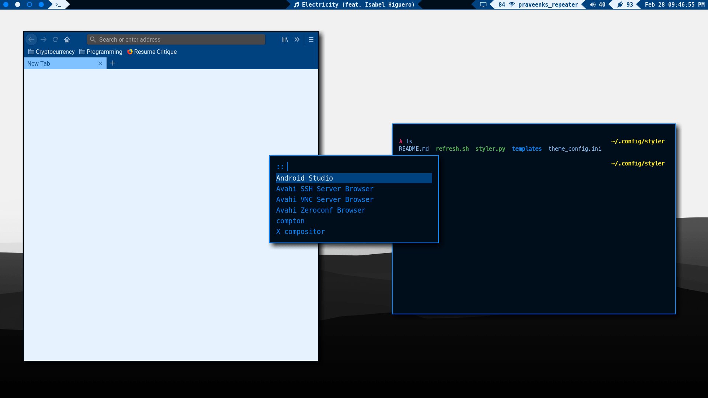
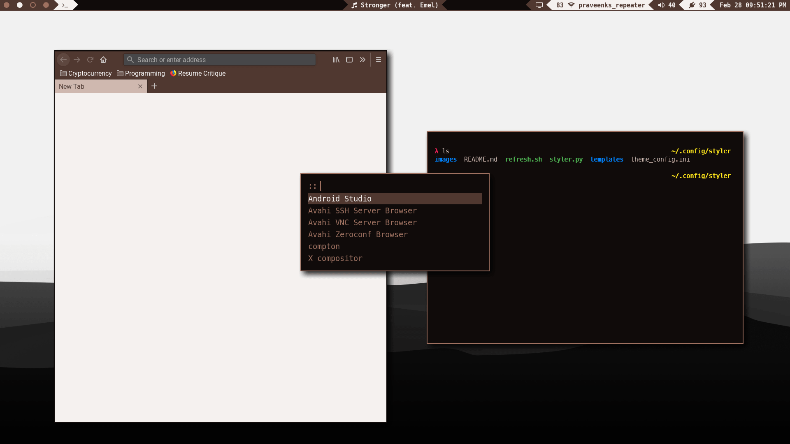

# Automatic theming of configuration files using templates

Normal Desktop               |  Lock Screen
:---------------------------:|:---------------------------:
         |  
        |  

`configurer.py` uses 3 main resources to allow for automating configuration of certain parameters for various config files
 1. `CONFIG_FILE`: A file that specifies the key/value pairs to be used for template substitution
 2. `TEMPLATES_DIR`: A directory containing all the template files to be processed and generated
 3. `REFRESH_SCRIPT`: An optional executable script to allow for reloading/updating/refreshing any programs using the newly generated templates

> NOTE: `configurer.py` processes all the templates in `TEMPLATES_DIR` and skips any template with either missing or malformed parameters or placeholders

## Usage
### Command line options
```
usage: configurer.py [-h] [-c CONFIG_FILE] [-t TEMPLATES_DIR] [-r REFRESH_SCRIPT]
                 [-q]

optional arguments:
  -h, --help            show this help message and exit
  -c CONFIG_FILE, --config_file CONFIG_FILE
                        config INI file used for template substitutions
                        (default: ./theme_config.ini)
  -t TEMPLATES_DIR, --templates_dir TEMPLATES_DIR
                        directory containing templates to configure (default:
                        ./templates/)
  -r REFRESH_SCRIPT, --refresh_script REFRESH_SCRIPT
                        refresh script to run after distributing templates to
                        allow for changes to take effect (default: None)
  -q, --quiet           suppress warnings (will still show errors) (default:
                        False)
```

### Examples
`$ configurer.py`: Use the default names (config file, templates directory and optionally reload script should be present in the current director)

`$ configurer.py -q`: Don't print warning messages (will still print error messages to `stderr`)

`$ configurer.py -c ~/.config/configurer/config.ini --templates_dir ~/.config/configurer/templates -r ~/.config/bspwm/refresh.sh`

# Configuration
### Config file
This file is parsed as an INI file with support for variable referencing within the file. The file can number of sections and parameters in each section. Below is a sample config file:
```ini
[theme]
primary_color    = ${colors:blue}
background_color = ${colors:black}
text_color       = ${colors:white}
font             = ${fonts:gui}

[colors]
black  = #000000
white  = #ffffff
red    = #ff0000
green  = #00ff00
yellow = #ffff00
blue   = #0000ff

[fonts]
gui       = Roboto
powerline = Meslo LG S for Powerline
fonts     = FontAwesome
```

### Templates
A template is a copy of a resource configuration file for a specific program with placeholders in place of values to be populated using the `CONFIG_FILE`. All templates must be stored within the `TEMPLATES_DIR` directory. The name of the template file can be arbitrary as the name of the final generated file will be specified within the template file. All templates need to start with a section of parameters (in the form of `key = value`) for `configurer` to use. Currently there are two required template parameters:

 1. `destination`: to specify where to save the generated file
 2. `executable`: to specify whether or not to make the file executable (such as in the case of `.sh` files)

A line consisting only of `'-'` (dashes) marks the end of the parameters section and everything that follows is the template. Use the `{{section:parameter}}` syntax to refer to any parameters/values from the `CONFIG_FILE`. Below is a sample template for Rofi's configuration file:
```
destination = ~/.config/rofi/config
executable = False
-----------------------------------------------------------
rofi.color-enabled   : true
rofi.color-window    : {{theme:background_color}}, {{theme:primary_color}}, {{theme:background_color}}
rofi.color-normal    : {{colors:red}}, {{theme:text_color}}, {{colors:green}}, {{theme:text_color}}, {{colors:yellow}}
rofi.font            : {{fonts:powerline}} 14
rofi.lines           : 6
```

### Refresh script
Optionally, an executable script can also be provided which will run at the end to allow for automatically refreshing any changes caused by updating the config files. Below is a sample script:
```sh
i3-msg restart           # restart i3 (for use if any changes were made to the i3 config file)
killall -USR1 termite    # Send a signal to termite (terminal emulator) to tell it to reload its config file
```
